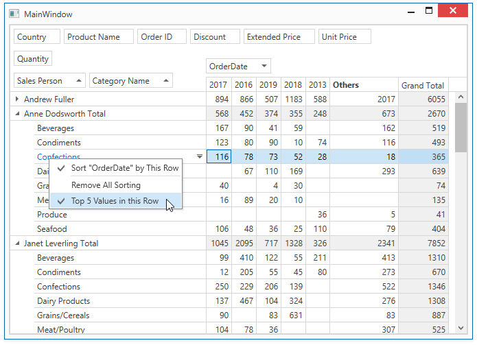

<!-- default badges list -->

<!-- default badges end -->
# Pivot Grid for WPF - How to Implement a Context Menu Action to Display Top 5 Values in a Column or Row

The key task is to enable the [Sorting by Summary](https://docs.devexpress.com/WPF/8072) and [Top N Values](https://docs.devexpress.com/WPF/8063) features simultaneously.

API in this example:

* [PivotGridControl.PopupMenuShowing](https://docs.devexpress.com/WPF/DevExpress.Xpf.PivotGrid.PivotGridControl.PopupMenuShowing) event
* [PopupMenuShowingEventArgs.TargetElement](https://docs.devexpress.com/WPF/DevExpress.Xpf.PivotGrid.PopupMenuShowingEventArgs.TargetElement) property
* [FieldValueElement](https://docs.devexpress.com/WPF/DevExpress.Xpf.PivotGrid.FieldValueElement) class
* [FieldValueElementData](https://docs.devexpress.com/WPF/DevExpress.Xpf.PivotGrid.FieldValueElementData) class
* [PivotGridControl.GetFieldsByArea](https://docs.devexpress.com/WPF/DevExpress.Xpf.PivotGrid.PivotGridControl.GetFieldsByArea(DevExpress.Xpf.PivotGrid.FieldArea)) method
* [PivotGridControl.GetFieldValue](https://docs.devexpress.com/WPF/DevExpress.Xpf.PivotGrid.PivotGridControl.GetFieldValue.overloads) method
* [SortByConditionCollection](https://docs.devexpress.com/WPF/DevExpress.Xpf.PivotGrid.SortByConditionCollection) class
* [PivotGridField.SortByConditions](https://docs.devexpress.com/WPF/DevExpress.Xpf.PivotGrid.PivotGridField.SortByConditions) property
* [PivotGridField.SortByOrder](https://docs.devexpress.com/WPF/DevExpress.Xpf.PivotGrid.PivotGridField.SortByOrder) property
* [PivotGridField.SortByField](https://docs.devexpress.com/WPF/DevExpress.Xpf.PivotGrid.PivotGridField.SortByField) property
* [PivotGridField.TopValueCount](https://docs.devexpress.com/WPF/DevExpress.Xpf.PivotGrid.PivotGridField.TopValueCount) property 
* [PivotGridField.TopValueShowOthers](https://docs.devexpress.com/WPF/DevExpress.Xpf.PivotGrid.PivotGridField.TopValueShowOthers) property 
<!-- feedback -->
## Does this example address your development requirements/objectives?

 

(you will be redirected to DevExpress.com to submit your response)
<!-- feedback end -->
